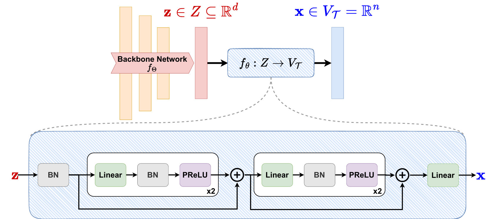

# Hier-COS and HOPS

Official code repository for **[Learning and Evaluating Hierarchical Feature Representations](https://arxiv.org/pdf/2503.07853)** <br/>
Depanshu Sani and Saket Anand


## Contributions
- **Hierarchical Composition of Orthogonal Subspaces** (Hier-COS) is a framework that transforms the features extracted from a deep learning backbone (z) to a vector space that is, by design, consistent with the given label hierarchy tree. <br />
- **Hierarchically Ordered Preference Score** (HOPS) is a metric to benchmark hierarchical classifiers that leverages the preference ordering based on the hierarchy tree.

<div align="center">
  
</div>

## Installation
This code repository successfully runs with Python 3.6.13. Other versions of Python might not be supported.
```commandline
conda env create -f environment.yml
```

## Dataset preparation
For iNaturalist2019 and tieredImageNet-H: <br/>
Refer to Repository: [Making Better Mistakes](https://github.com/fiveai/making-better-mistakes) <br/> 
For CIFAR-100, we use torchvision.datasets. CIFAR100 API in:
```
util/data_loader.py
```
For FGVC-Aircraft, the dataset preparation code is at:
```
_fgvc_aircraft/fgvc_dataset_preprocessing.py
```

## Configure dataset paths
modify the /data_paths.yml files, e.g.:
```
fgvc-aircraft: '<PATH_TO_DATASETS>/fgvc_aircraft/'
cifar-100: '<PATH_TO_DATASETS>/CIFAR-100/'
inaturalist19-224: '<PATH_TO_DATASETS>/iNat2019/'
tiered-imagenet-224: '<PATH_TO_DATASETS>/tiered_ImageNet_H/'
```

## The Hierarchies and hierarchical distances
For iNaturalist2019 and tieredImageNet-H: <br/>
Refer to Repository: [Making Better Mistakes](https://github.com/fiveai/making-better-mistakes). <br/> 
For CIFAR-100, its hierarchy is provided by [Fine-Grained-or-Not](https://github.com/PRIS-CV/Fine-Grained-or-Not). <br/>
For FGVC-Aircraft, its hierarchy comes with the dataset's annotations. 

We also provide copies of the hierarchies used in this work: <br/>
```
data/fgvc_aircraft_tree.pkl
data/cifar-l5/original/cifar_100_tree.pkl
data/inaturalist19_tree.pkl
data/tiered_imagenet_tree.pkl
```
The associated hierarchical distances files are located at: <br/>
```
data/fgvc_aircraft_original_distances.pkl.xz
data/cifar-l5/original/cifar_100_ilsvrc_distances.pkl.xz
data/inaturalist19_ilsvrc_distances.pkl.xz
data/tiered_imagenet_ilsvrc_distances.pkl.xz
```

## Pre-trained models
Pre-trained model weights (seed 0) for hier-cos method can be downloaded from [this link](https://drive.google.com/drive/folders/1e4mtYSqeWVMd462vFPmuOU1BEIFLWlwI?usp=sharing).

## Pre-trained ViT
We use the ViT-MAE pre-trained on iNat-21 dataset from [this link](https://huggingface.co/vesteinn/vit-mae-inat21). The code to downlaod the pretrained weights is already integrated in the repository.

## Experiments

Training and testing scripts for all the datasets are included in:
```
experiments
```
Use the following command to execute the training and testing commands:
```commandline
bash experiments/<DATASET>/<METHOD>.sh
```

All the bash scripts need to be executed at the same directory with main.py <br/>


## Acknowledgement
The python file `util/hiercos_construction.py` contains the **most important** changes (Hier-COS construction and the loss function). This codebase is largely refactored from the following GitHub repositories: <br/>

- [HAF](https://github.com/07Agarg/HAF)
- [HAFrame](https://github.com/ltong1130ztr/HAFrame)


 